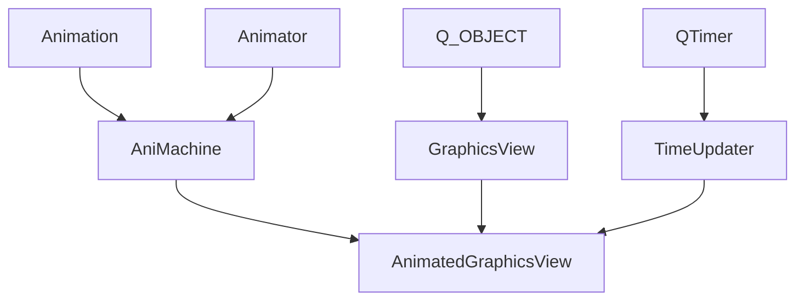
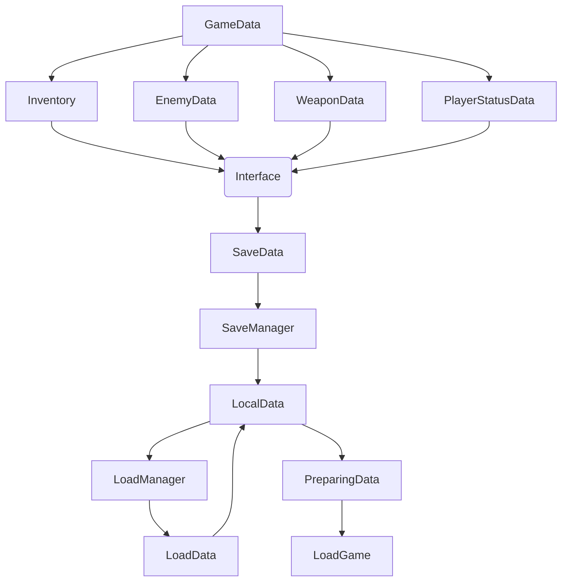

# # GossEmperis ‘s Qt aniMachine

Hello，welcome to gossemperis‘s Qt aniMachine，this is my first project which is build all on my own，Including but not limited to program and art。This project was built while I was learning Qt, so there will be a lot of stupid code written. But in the end this project works smoothly and is exciting!


### **Some Ani created in asprite**

*Convergence of Water Balloon*


*The spread of energy*


*Flying posion ball*


*Save and load UI*


*Slime*


*SuperBox*


### [演示视频 demo video]

[](//player.bilibili.com/player.html?isOutside=true&aid=114302954505823&bvid=BV1GmdpYvEQj&cid=29306127525&p=1)

# How to build the AnimatedGraphicsView：

```
AnimatedGraphicsView(QWidget* parent = nullptr) : QGraphicsView::QGraphicsView(parent)
	{	
		aniTimer = new QTimer(this);
		aniTimer->setInterval(UI_Tick_Interval);
		QObject::connect(aniTimer, SIGNAL(timeout()), this, SLOT(TimeTick()));
		isUpdating = false;
	}
	
	AnimatedGraphicsView()
	{

	}
	~AnimatedGraphicsView()
	{	
		if(aniTimer != NULL)
			delete aniTimer;
	}

	void CreateAni(QMap<QString, Animation> graAniDic)
	{
		graAnimator = Animator(this, graAniDic);
		graAnimator.SetOriginStyle(this->styleSheet());
		isUpdating = false;
	}

	void EnterActiveMode()
	{
		isActiveMode = true;
		aniTimer->start();
	}

	void ExitActiveMode()
	{
		isActiveMode = false;
		aniTimer->stop();
	}

	void EndLoadInTask()
	{
		canClicked = true;
	}
	
	void SetClickCallBack(bool isCallBack)
	{
		isClickCallBack = isCallBack;
	}

	/// <summary>
	/// if the button is ParameterMode
	/// that means this button can be only use for send data
	/// dont play any ani;
	/// </summary>
	/// <param name="parameter"></param>
	void SetParameterMode(int parameter)
	{	
		isParameterMode = true;
		this->parameter = parameter;

	}
```

AnimatedGraphicsView is a custom component constructed by combining all the dynamic components in the project , a borderless animated click component , supports multiple modes of operation , internally linked signal slots , internal threads and animation pool .
I use the Qtimer to build a new thread, so all the ani will be **Parallel**



# SaveAndLoadSystem

In my project, I use the virtual method to build the saving and loading task

```
virtual void Saving(QFile* fileToSave) = 0;
virtual void Loading(QFile* fileToLoad) = 0;
```

And all the class which is inherited from isaveable will be add to the list of save and load task.
Save&&Load manager gives us the method to run all the saving or loading task.



# Components

```echarts
{
  "backgroundColor": "#212121",
  "title": {
    "text": "Project Components",
    "subtext": "2024.5.20",
    "x": "center",
    "textStyle": {
      "color": "#f2f2f2"
    }
  },
  "tooltip": {
    "trigger": "item",
    "formatter": "{a} <br/>{b} : {c} ({d}%)"
  },
  "legend": {
    "orient": "vertical",
    "left": "left",
    "data": [
      "BattleSystem",
      "DataProcessing",
      "AniCodePart",
      "其他",
      "社交平台"
    ],
    "textStyle": {
      "color": "#f2f2f2"
    }
  },
  "series": [
    {
      "name": "",
      "type": "pie",
      "radius": "55%",
      "center": [
        "50%",
        "60%"
      ],
      "data": [
        {
          "value": 2400,
          "name": "BattleSystem",
          "itemStyle": {
            "color": "#ef4136"
          }
        },
        {
          "value": 1600,
          "name": "DataProcessing"
        },
        {
          "value": 6900,
          "name": "AniCodePart"
        },
        {
          "value": 2000,
          "name": "InventorySystem"
        },
        {
          "value": 1400,
          "name": "UISystem"
        }
      ],
      "itemStyle": {
        "emphasis": {
          "shadowBlur": 10,
          "shadowOffsetX": 0,
          "shadowColor": "rgba(0, 0, 0, 0.5)"
        }
      }
    }
  ]
}
```


